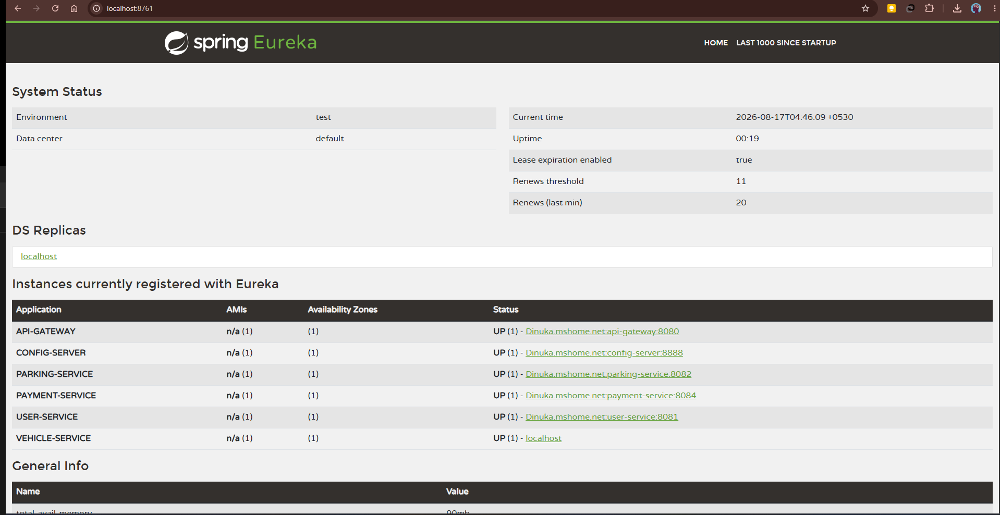

# Smart Parking Management System (SPMS)

An enterprise-grade, cloud-native microservice architecture designed for finding, reserving, managing, and paying for smart parking spaces in real-time.

---

## 🏛️ System Architecture

```
                            ┌────────────────────────┐
                            │    Clients / Postman   │
                            └───────────┬────────────┘
                                        │ HTTP / REST
                            ┌───────────▼────────────┐
                            │   Spring Cloud Gateway │
                            │       (Port: 8080)     │
                            └───────────┬────────────┘
                                        │ Dynamic Discovery
                            ┌───────────▼────────────┐
                            │     Eureka Server      │
                            │      (Port: 8761)      │
                            └───────────┬────────────┘
                                        │
          ┌─────────────────────────────┼─────────────────────────────┐
          │                             │                             │
┌─────────▼────────┐          ┌─────────▼────────┐          ┌─────────▼────────┐
│   User Service   │          │  Vehicle Service │          │  Parking Service │
│   Spring Boot    │          │      NestJS      │          │   Spring Boot    │
│   (Port: 8081)   │          │   (Port: 3001)   │          │   (Port: 8082)   │
└──────────────────┘          └──────────────────┘          └─────────┬────────┘
                                                                      │
┌──────────────────┐                                                  │ Publishes Events
│  Payment Service │ ◀────────────────────────────────────────────────┤
│   Spring Boot    │                                                  │
│   (Port: 8084)   │ ───────────────┐                                 │
└──────────────────┘                │                                 │
                                    │ Publishes Events                │
                                    ▼                                 ▼
                             ┌──────────────────────────────────────────┐
                             │           RabbitMQ Topic Exchange        │
                             │            (spms.events : 5672)          │
                             └────────────────────┬─────────────────────┘
                                                  │ Consumes Events
                                     ┌────────────▼─────────────┐
                                     │   Notification Service   │
                                     │         Go (Gin)         │
                                     │       (Port: 8085)       │
                                     └──────────────────────────┘
```

---

## 🚀 Microservices & Technology Reference

| Service | Technology | Port | Database / Broker | Key Features |
|---|---|---|---|---|
| **API Gateway** | Spring Cloud Gateway (WebFlux) | `8080` | Eureka Discovery | Single entry point, CORS, dynamic routing, load balancing |
| **Eureka Server** | Spring Cloud Netflix Eureka | `8761` | In-memory | Service registry, health monitoring dashboard |
| **Config Server** | Spring Cloud Config | `8888` | Local/Git repo | Centralized application configuration across microservices |
| **User Service** | Spring Boot 4 / Java 25 | `8081` | PostgreSQL (`spms_users`), Redis | RS256 JWT auth, role management (`DRIVER`, `OWNER`, `ADMIN`), profile management |
| **Vehicle Service** | NestJS / TypeScript | `3001` | PostgreSQL (`spms_vehicles`) | Polyglot microservice, vehicle registration, license plate validation, entry/exit logs |
| **Parking Service** | Spring Boot 4 / PostGIS (Java 25) | `8082` | PostgreSQL (`spms_parking`), Redis | Geospatial search (`ST_DWithin`), real-time availability caching, reservation engine |
| **Payment Service** | Spring Boot 4 / Java 25 | `8084` | PostgreSQL (`spms_payments`) | Mock Luhn card validation, transactional billing, digital receipts, refund processing |
| **Notification Service** | Go 1.21 / Gin | `8085` | RabbitMQ (`spms.events`) | Event consumer for booking emails, receipts, cancellation & IoT alerts |

---

## ⚙️ Centralized Configuration Repository (`spms-config-repo`)

All microservices fetch externalized configuration from the **Spring Cloud Config Server** (Port: `8888`), which loads centralized YAML files from the [`spms-config-repo/`](./spms-config-repo) repository:

| Service | Configuration File | Key Settings Managed |
|---|---|---|
| **API Gateway** | [`api-gateway.yml`](./spms-config-repo/api-gateway.yml) | Reactive dynamic routing, CORS policy, public auth whitelists |
| **Eureka Server** | [`eureka-server.yml`](./spms-config-repo/eureka-server.yml) | Service discovery registry settings, eviction timeouts |
| **User Service** | [`user-service.yml`](./spms-config-repo/user-service.yml) | PostgreSQL DB credentials, RSA JWT Keystore paths, JPA settings |
| **Vehicle Service** | [`vehicle-service.yml`](./spms-config-repo/vehicle-service.yml) | PostgreSQL DB connection, NestJS port configuration |
| **Parking Service** | [`parking-service.yml`](./spms-config-repo/parking-service.yml) | PostGIS spatial DB connection, Redis cache TTL, RabbitMQ exchange |
| **Payment Service** | [`payment-service.yml`](./spms-config-repo/payment-service.yml) | PostgreSQL DB connection, RabbitMQ payment events |
| **Notification Service** | [`notification-service.yml`](./spms-config-repo/notification-service.yml) | SMTP Mail credentials, RabbitMQ notification queues |

**How It Works:**
1. On startup, the Spring Cloud Config Server automatically loads YAML definitions from `spms-config-repo/`.
2. Microservices import their environment configuration at startup via `spring.config.import=optional:configserver:http://localhost:8888`.
3. In Docker Compose, the repository is mounted to `/app/spms-config-repo` so configuration changes apply without rebuilding images.

---

## 🔒 Security Architecture (Zero-Trust)

- **Asymmetric Signing (RS256)**: Tokens are signed with a 2048-bit RSA Private Key held exclusively by the **User Service**.
- **Edge Validation**: The **API Gateway** verifies token signatures and expiration locally using the cached RSA Public Certificate.
- **Stateless Verification**: Downstream microservices independently validate Bearer tokens using their local RSA Public Key (`spms-jwt-public.pem`) without calling the User Service over the network.
- **Refresh Token Rotation**: Secure long-lived refresh tokens are stored and verified in **Redis** with automated revocation.

---

## 🛠️ Infrastructure & Prerequisites

- **Docker & Docker Compose** (Docker Desktop recommended)
- **Java 25+** & **Node.js 20+** (for running locally without Docker)
- **Go 1.21+** (for running notification service locally)

---

## ⚡ Quick Start with Docker Compose

To start all infrastructure and microservices with a single command:

```bash
# 1. Clone the repository
git clone https://github.com/dinukaly/Smart-Parking-System.git
cd Smart-Parking-System

# 2. Launch all services and infrastructure
docker compose up --build -d

# 3. View running container logs
docker compose logs -f
```

### Infrastructure Management UIs
- **Eureka Dashboard**: [http://localhost:8761](http://localhost:8761)
- **RabbitMQ Management**: [http://localhost:15672](http://localhost:15672) (User: `spms_admin` / Pass: `spms_password`)
- **API Gateway**: [http://localhost:8080](http://localhost:8080)
- **Swagger UI (Parking)**: [http://localhost:8082/swagger-ui.html](http://localhost:8082/swagger-ui.html)
- **Swagger UI (Payment)**: [http://localhost:8084/swagger-ui.html](http://localhost:8084/swagger-ui.html)
- **Swagger UI (Vehicle)**: [http://localhost:3001/api/docs](http://localhost:3001/api/docs)

---

## 🧪 Postman Test Suite

A complete test suite covering all microservices, happy paths, and edge cases is included:

- **Collection File**: [`postman_collection.json`](postman_collection.json)
- **Environment File**: [`postman_environment.json`](postman_environment.json)

### Importing & Running in Postman:
1. Open Postman and click **Import**.
2. Select both `postman_collection.json` and `postman_environment.json`.
3. Select the **SPMS - Local Environment**.
4. Run the collection using the **Collection Runner** to verify end-to-end tests across all services.

---

## 📸 Screenshots

### Eureka Service Discovery Dashboard
All microservices dynamically discovered and healthy:



---

## 🔮 Future Expansion & Planned Features (AI Service)

The architecture is designed to be easily extensible. An upcoming **Smart Parking AI Service** will connect to the existing ecosystem asynchronously via RabbitMQ without requiring code changes to any existing microservice:

```
                   RabbitMQ (`spms.events`)
                               │
                 ┌─────────────┴─────────────┐
                 │                           │
       Notification Service      Smart Parking AI Service
             Go (Gin)                Python (FastAPI)
                                             │
                                      ┌──────┴──────┐
                                      │ Features    │
                                      │ • Occupancy │
                                      │   prediction│
                                      │ • Dynamic   │
                                      │   pricing   │
                                      │ • Peak-hour │
                                      │   analysis  │
                                      └─────────────┘
```

### Planned AI Capabilities:
- **Occupancy Prediction**: Machine learning time-series models (e.g., Prophet / LSTM) to forecast space availability by zone, day of the week, and weather.
- **Dynamic Pricing Engine**: Automated pricing adjustments based on real-time occupancy rates, special events, and peak demand hours.
- **Parking Spot Owner Insights**: Analytics dashboards providing spot utilization, revenue forecasting, and churn analysis.

---

## 📜 License

This project is licensed under the Apache 2.0 License.
